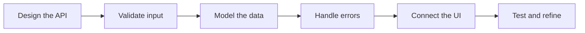

<!--
  GitHub Profile README for Ubaid
  Create a public repository named exactly: Ubaid-Stack
  Then place this file at the root of that repository.
-->

<div align="center">


<a href="https://itsubaid.dev">
  
</a>

<p>
  <a href="https://itsubaid.dev"></a>
  <a href="https://github.com/Ubaid-Stack?tab=repositories"></a>
  
</p>

</div>

---

### The developer behind the screen

```ts
const ubaid = {
  role: "Full-Stack Software Engineer",
  location: "Sri Lanka",
  focus: ["Clean architecture", "Useful products", "Premium UI/UX"],
  frontend: ["React", "TypeScript", "Tailwind CSS"],
  backend: ["Node.js", "Express", "MongoDB"],
  currentlyBuilding: "Production-ready full-stack applications",
  principle: "Understand it. Build it. Improve it.",
};
```

I’m **Ubaidullah**, a software engineer who enjoys connecting clean backend logic with polished frontend experiences. I care about the details users notice, the architecture developers maintain, and the steady practice required to become excellent at both.

- Building toward production-ready **MERN stack** applications
- Exploring API design, validation, authentication, data modeling, and scalable structure
- Keeping my React skills sharp while going deeper into backend engineering
- Open to junior full-stack opportunities, collaboration, and meaningful products

### My engineering toolkit

<div align="center">

| Frontend | Backend | Data & Validation | Workflow |
|:---:|:---:|:---:|:---:|
|  |  | <br/><sub>Mongoose · Zod · REST APIs</sub> |  |

</div>

### Selected work

<table>
  <tr>
    <td width="50%" valign="top">
      <h3>PreviewUI</h3>
      <p>A SaaS concept that helps developers and designers preview colors, typography, accessibility, and design systems in realistic interfaces before writing code.</p>
      <p><code>React</code> <code>TypeScript</code> <code>Tailwind CSS</code> <code>Product Design</code></p>
    </td>
    <td width="50%" valign="top">
      <h3>IronPeak</h3>
      <p>A premium, responsive fitness experience with a bold visual system, reusable components, thoughtful interactions, and production-focused frontend structure.</p>
      <p><code>React</code> <code>TypeScript</code> <code>Tailwind CSS</code> <code>Motion</code></p>
    </td>
  </tr>
  <tr>
    <td width="50%" valign="top">
      <h3>GameHub</h3>
      <p>A responsive game-discovery interface powered by the RAWG API, with reusable data-fetching logic, filters, loading skeletons, and a component-driven UI.</p>
      <p><code>React</code> <code>TypeScript</code> <code>Chakra UI</code> <code>REST API</code></p>
    </td>
    <td width="50%" valign="top">
      <h3>Portfolio</h3>
      <p>My digital home for selected projects, engineering progress, and the story behind the products I’m learning to build.</p>
      <p><code>React</code> <code>Responsive UI</code> <code>Vercel</code></p>
      <a href="https://itsubaid.dev"><strong>Visit itsubaid.dev →</strong></a>
    </td>
  </tr>
</table>

<div align="center">
  <a href="https://github.com/Ubaid-Stack?tab=repositories">
    
  </a>
</div>

### What I’m sharpening now



My current backend path includes **Express architecture, MongoDB relationships, pagination, async error handling, authentication, security, and testing**—paired with short React and TypeScript practice to keep the full stack connected.

### GitHub activity

<div align="center">
  
  
</div>

<div align="center">
  
</div>

<sub>Note: language statistics describe public repository code; they are not a measure of skill level.</sub>

---

<div align="center">

### Let’s build something worth using.

I’m interested in thoughtful products, strong engineering foundations, and teams where learning turns into real impact.

<a href="https://itsubaid.dev">
  
</a>

<br/><br/>

<code>Crafted with intention by Ubaidullah.</code>

</div>


