 

 

  

 

`~/whoami`
## About

I'm **Ubaidullah**, a full-stack software engineer who enjoys connecting clean backend logic with polished frontend experiences. I care about the details users notice, the architecture developers maintain, and the steady practice it takes to get good at both.

- Building toward production-ready **MERN stack** applications
- Exploring API design, validation, authentication, data modeling, and scalable structure
- Keeping React sharp while going deeper into backend engineering
- Open to junior full-stack opportunities, collaboration, and meaningful products

`~/stack.json`
## Tech Stack

**Languages**
 

**Frontend**
 

**Backend**
 

**Tools & Design**
 

`~/work`
## Featured Projects

<table>
<tr>
<td width="50%" valign="top">

### IronPeak
A gym platform with a diagonal-clip hero, glassmorphism navigation, and a fully accessible mobile nav.

`React` `TypeScript` `Tailwind v4`

</td>
<td width="50%" valign="top">

### FitPulse
A fitness app that turns workout tracking into a clean, motivating daily habit.

`React` `UI/UX` `Figma`

</td>
</tr>
<tr>
<td width="50%" valign="top">

### VelvetVogue
An e-commerce concept built around an editorial, gallery-style browsing experience.

`React` `TypeScript` `CSS`

</td>
<td width="50%" valign="top">

### BiteRush
A food delivery interface designed around fast, low-friction ordering flows.

`React` `TypeScript` `UI/UX`

</td>
</tr>
</table>

Live links and write-ups live in the pinned repositories above ↑

`~/stats --live`
## GitHub Metrics

`~/connect`
## Let's Connect

<!-- Verify/replace the LinkedIn, Portfolio, and Email links below before publishing -->

 

Built with intention, one commit at a time.

